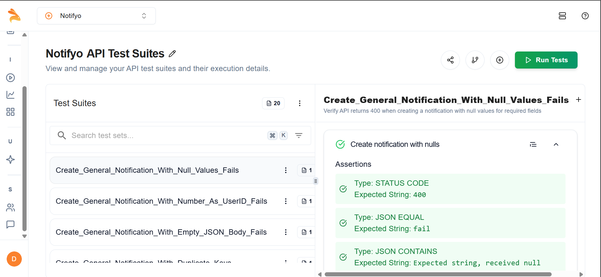
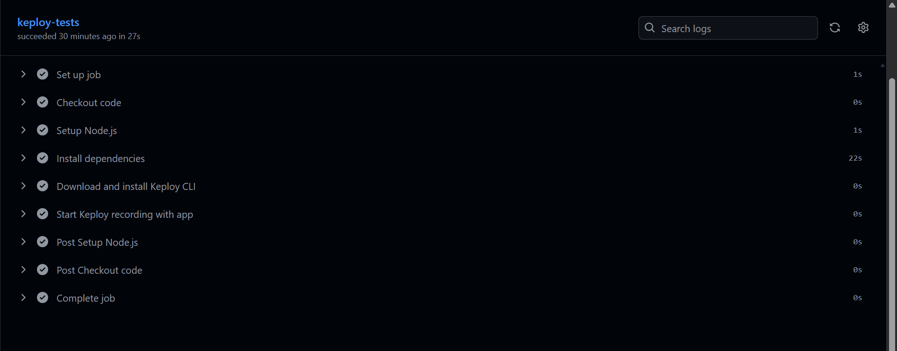
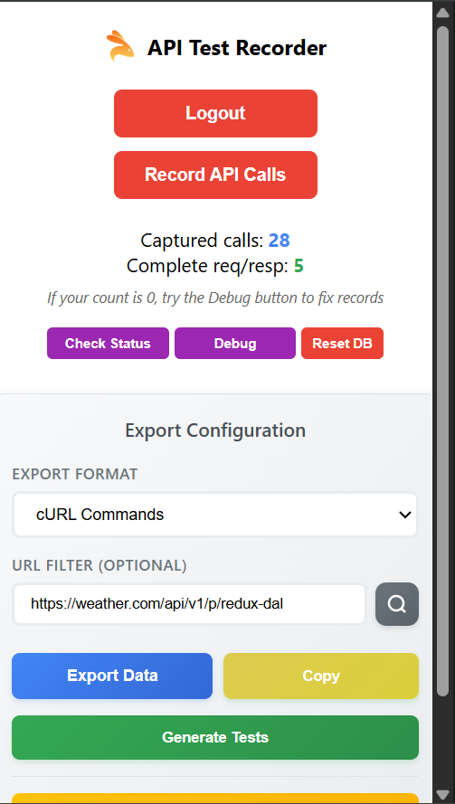
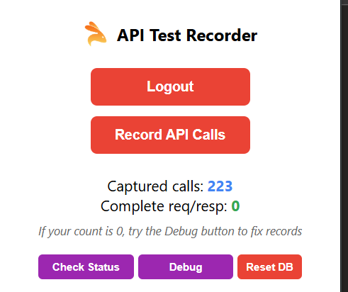
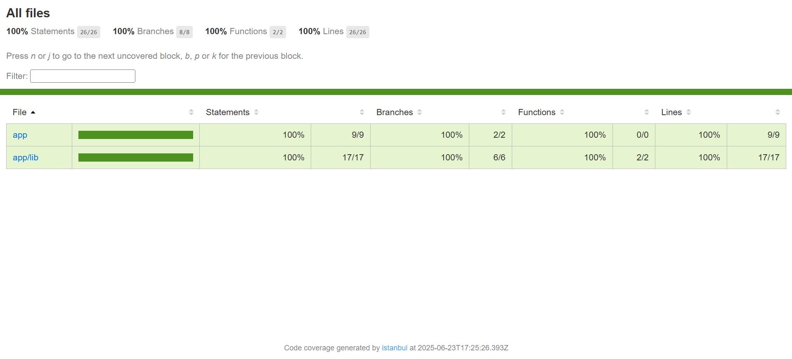

# 🚀 Keploy Fellowship  Assignment - API Testing with AI

This repository contains my submission for **Task 1** and **Task 2** of the Keploy Internship Program. It showcases how I used **Keploy** to achieve full API test coverage using AI and integrated it into a **CI/CD pipeline**. I also explored the **Keploy Chrome Extension** for API testing and shared my experience via a blog post.

---

## ✅ Task 1: API Testing with Keploy AI + CI/CD Integration

### 📌 Steps Implemented:

- ✅ Created an OpenAPI schema for the project
- ✅ Generated test cases using Keploy CLI
- ✅ Integrated API Testing into GitHub Actions
- ✅ Ensured pipeline runs successfully after Keploy test generation
- ✅ Uploaded Keploy test reports and screenshots

### 🛠️ Tech Stack

- `Next.js App Router`
- `Prisma ORM`
- `Keploy`
- `Jest & Supertest`
- `GitHub Actions`

### 📷 Screenshot of Keploy Test Reports  
_Add your actual screenshot image in the repo and link it below_



---

## 🔁 CI/CD Integration

GitHub Actions workflow automatically runs `keploy record` and validates API tests on every push.

📁 **GitHub Workflow File**: `.github/workflows/keploy.yml`

```yaml
name: keploy-tests
on:
  push:
    branches: [main]

jobs:
  run-keploy:
    runs-on: ubuntu-latest
    steps:
      - name: Checkout Repo
        uses: actions/checkout@v3

      - name: Setup Node
        uses: actions/setup-node@v3
        with:
          node-version: '18'

      - name: Install Dependencies
        run: npm install

      - name: Download Keploy Binary
        run: |
          curl -sL https://github.com/keploy/keploy/releases/latest/download/keploy-linux-amd64 -o keploy
          chmod +x keploy
          sudo mv keploy /usr/local/bin/keploy

      - name: Start Keploy and Record
        run: keploy record -c "npm run start" --delay 10
```
    


# 🌐 Task 2: API Testing with Keploy Chrome Extension

As part of the Keploy Internship, this task focused on testing APIs from live websites using the **Keploy Chrome Extension** and documenting the experience.

---

## ✅ What Was Done

- ✅ Used the **Keploy Chrome Extension** to capture API calls in real-time.
- ✅ Tested APIs on two popular real-world websites:
  1. **[Insert Website Name #1]** – Tested dynamic data loading via API
  2. **[Insert Website Name #2]** – Captured login/data POST APIs
- ✅ Observed automatic generation of curl commands and test files without writing a single test manually.
- ✅ Captured and reviewed test cases on the Keploy dashboard.

---

## 🧪 Why It Was Awesome

- 🧠 **AI-Powered Testing**: No need to write test cases manually
- ⚡ **Zero Setup**: Just open browser, capture, test
- 💬 **Live Feedback**: Instantly saw what APIs were fired and how they were tested
- 📂 **Exportable**: Test cases are downloadable and reusable

---

## 📝 Blog Post

I documented my experience in this Medium blog post:

📖 **[How I Went from Zero to Full API Test Coverage Using Keploy in Minutes](https://medium.com/@devanshbajpai07/how-i-went-from-zero-to-full-api-test-coverage-using-keploy-in-minutes-caf697cd4419)**

> In this article, I explain the difference between traditional/manual API testing and Keploy’s AI-assisted testing. I also walk through the Chrome Extension, sharing how it helped me achieve 100% test coverage in minutes.

---

## 📸 Screenshots

| Capturing API with Keploy Extension | Auto-generated curl command |
|-------------------------------------|-----------------------------|
|  |  |

> Make sure to place these screenshots in the `assets/` folder of your repo.

---

## 🔗 Useful Links

- 🧩 [Keploy Chrome Extension](https://chrome.google.com/webstore/detail/keploy-api-testing-ai/...)
- 🌍 [Keploy Official Site](https://keploy.io/)
- 📖 [Keploy Docs](https://docs.keploy.io/)
- ✍️ [My Blog on Medium](https://medium.com/@devanshbajpai07/how-i-went-from-zero-to-full-api-test-coverage-using-keploy-in-minutes-caf697cd4419)

---

## 👨‍💻 Author Info

- **Name**: Devansh Bajpai
- 📧 Email: devanshbajpai07@gmail.com
- 💼 [LinkedIn](https://linkedin.com/in/devanshbajpai)
- ✍️ [Medium Blog](https://medium.com/@devanshbajpai07/how-i-went-from-zero-to-full-api-test-coverage-using-keploy-in-minutes-caf697cd4419)

---

## ✅ Final Notes

- 🎯 This task showcases the simplicity of AI-powered API testing using a browser.
- 🚀 Reduced hours of test-writing effort to a few minutes.
- 📖 Documented the whole journey and shared insights for other developers and testers.

---

> ⭐ Star this repo if you find it helpful, and try Keploy to automate your API testing today!


# 📬 Notification Service API - Testing Task

This repository contains a custom **Notification Service API** that supports **Email**, **SMS**, and **In-App notifications**, built using **Next.js App Router** and **Prisma**, along with comprehensive **unit, integration, and API tests** using **Jest** and **Supertest**.

---

## Screen Shot



## 📌 Features

- ➕ Create new notifications
- 📦 Store notifications in the database using Prisma ORM
- 🧪 100% unit test coverage for utility functions
- 🔗 Integration testing with a live database
- ✅ API testing using Supertest
- 🚀 Fully tested using Jest with VM modules

---

## 🧰 Tech Stack

| Layer         | Tech                              |
|---------------|-----------------------------------|
| Frontend      | Next.js (App Router)              |
| Backend       | API Routes in Next.js             |
| ORM           | Prisma                            |
| Database      | PostgreSQL / MySQL (choose one)   |
| Testing       | Jest + Supertest                  |

---

## 🧪 Testing Strategy

### ✅ Unit Tests (`__test__/unit`)
Test utility functions like `cn()` and `getTypeVariant()` for correctness.

### 🔗 Integration Tests (`__test__/integration`)
Tests Prisma and DB interaction directly by:
- Inserting test data
- Cleaning up after each test

### 🌐 API Tests (`__test__/api`)
Simulates real HTTP requests to:
- POST `/api/notifications`
- Validates response code and body

---

## 📦 Installation & Running

```bash
# Clone the repo
git clone https://github.com/yourusername/keploy-task-2.git
cd keploy-task-2/app

# Install dependencies
npm install

# Setup Prisma (optional: modify DATABASE_URL in .env)
npx prisma generate
npx prisma migrate dev --name init

# Run the development server
npm run dev
```

## Project Structure

app/
├── __test__/
│   ├── unit/
│   │   └── utils.test.js
│   ├── integration/
│   │   └── notification.integration.test.js
│   └── api/
│       └── notifications.api.test.js
├── lib/
│   └── utils.js
├── api/
│   └── notifications/
│       └── route.js


# Full-Stack Notification Service

This is a full-stack notification service built with a modern web development stack. The project allows users to receive different types of notifications (In-app, Email, SMS) and provides APIs to send, view, update, and delete notifications. The backend uses **PostgreSQL**, **NeonDB**, **RabbitMQ**, and **Twilio**, while the frontend is built using **Next.js**, **TailwindCSS**, **Shadcn UI**, and **React Icons**.

## Features

- **In-app notifications** for user interactions.
- **Email notifications** using **Resend**.
- **SMS notifications** using **Twilio API**.
- API endpoints to **send**, **view**, **update**, and **delete** notifications.
- Responsive and interactive frontend with **Next.js**, **TailwindCSS**, and **Shadcn UI**.
- Real-time updates with **RabbitMQ** message queue.
- Fully functional user interface with **React Icons** for icons.

## Technologies Used

### Backend
- **Node.js**: Server-side environment to handle API requests.
- **Next.js**: Full-stack React framework used for building both frontend and backend.
- **Prisma ORM**: For interacting with the PostgreSQL database.
- **PostgreSQL/NeonDB**: Relational database to store notification data.
- **RabbitMQ**: Message queue for handling notification events asynchronously.
- **Twilio**: For sending SMS and email notifications via their respective APIs.

### Frontend
- **Next.js**: Full-stack React framework.
- **TailwindCSS**: Utility-first CSS framework for building responsive and styled components.
- **Shadcn UI**: A design system for building clean and customizable UI components.
- **React Icons**: For adding icons to UI components.

### APIs
- **`/api/notifications`**: Endpoint for sending notifications.
- **`/api/user/[id]/notifications`**: Endpoint for viewing notifications of a specific user.
- **`/api/user/[id]/update`**: Endpoint to update a notification message.
- **`/api/user/[id]/delete`**: Endpoint to delete a specific notification.

## Setup

### 1. Clone the Repository

```bash
git clone https://github.com/DevanshBajpai09/Keploy-task.git
cd Keploy-task


### 2. Install Dependencies
Run the following command to install all necessary dependencies:
```bash 
npm install
```  
### 3. Set Up Environment Variables
Create a .env file in the root directory of the project and add the following environment variables:
```bash 
DATABASE_URL=<your_postgresql_url>
RABBITMQ_URL=<your_rabbitmq_url>
QUEUE_NAME=<your_queue_name>
TWILIO_SID=<your_twilio_sid>
TWILIO_AUTH_TOKEN=<your_twilio_auth_token>
TWILIO_PHONE_NUMBER=<your_twilio_phone_number>
RESEND_API_KEY=<your_resend_api_key>
```

### 4. Run the Application
To start the application, use the following command:

```bash 
npm run dev
```

# API Dcumeetation

## Overview
The application exposes several API endpoints to interact with notifications. These endpoints allow you to send notifications, retrieve notifications for a specific user, and mark notifications as read. The system supports In-app, Email, and SMS notifications. Below is a detailed documentation of the available APIs.

## Base URL
The base URL for all API endpoints is:

```bash 
http://localhost:3000/api
```

## 1. Send Notification

POST /api/notifications
This endpoint is used to send a new notification (In-app, Email, or SMS) to a user.

Request Body:

```bash 
{
  "userId": "string",      // The user ID to whom the notification will be sent.
  "message": "string",     // The content of the notification.
  "type": "string",        // The type of notification. It can be one of: "inapp", "email", "sms".
  "email": "string",       // (Optional) The email address for sending email notifications.
  "phoneNumber": "string"  // (Optional) The phone number for sending SMS notifications.
}
```

Response:

```bash 
{
  "success": true,                 // Whether the notification was successfully enqueued.
  "notification": {                // The notification data that was sent.
    "id": "1234",
    "userId": "string",
    "message": "string",
    "type": "inapp",
    "createdAt": "2025-01-01T00:00:00Z"
  }

```

## 2. Get User Notifications
GET /api/user/[id]/notifications
This endpoint retrieves all notifications for a specific user. Notifications are returned in descending order based on the creation date.

URL Parameters:
id (required): The ID of the user for whom the notifications are being fetched.

Response:

```bash 
{
  "notifications": [
    {
      "id": "1234",
      "userId": "string",
      "message": "string",
      "type": "inapp",
      "createdAt": "2025-01-01T00:00:00Z"
    },
    {
      "id": "1235",
      "userId": "string",
      "message": "string",
      "type": "email",
      "createdAt": "2025-01-02T00:00:00Z"
    }
  ]
}

```

## 3. Mark Notifications as Read

PATCH /api/user/[id]/notifications
This endpoint marks notifications as read for a specific user. You can either mark all unread notifications as read or mark a specific notification as read by providing its notificationId.

URL Parameters:
id (required): The ID of the user whose notifications are being updated.

Request Body (optional):
notificationId (optional): The ID of the notification to mark as read. If not provided, all unread notifications for the user will be marked as read.

```bash 
{
  "notificationId": "string"  // The ID of the notification to mark as read.
}
```

Response:
```bash 
{
  "success": true  // Indicates that the operation was successful.
}
```


